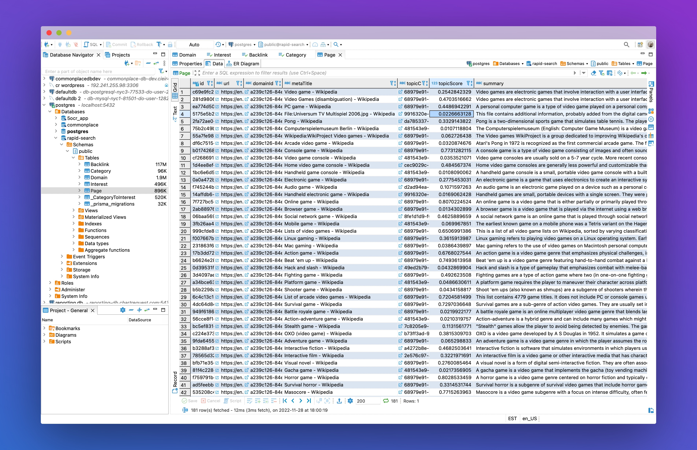

# RapidSearch

RapidSearch is a web crawler and collection of APIs. It is designed to digest and analyze pages using open-source machine learning models, and then make these pages available via a GraphQL interface.

- Crawler uses Node.js Workers, Prisma, Puppeteer, and Cheerio
- GraphQL API uses Prisma and Nexus
- Scoring API uses Flask, Flask-RESTful, and SpaCy
